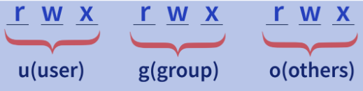
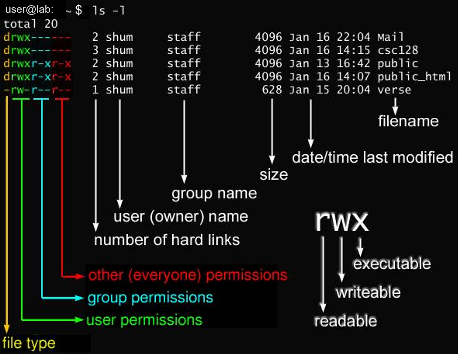

# List file and directory 
 ``` bash
# Lists files and directories recursively
ls -R
 ```


# Permission / Change Mode (chmod)

There are 3 type of people accessing a file/directory, they are:
   - User (u)
   - Group (g)
   - Others (o)
   
Also, there are 3 type of access to each of them:
   - Read (r)
   - Write (w)
   - Execute (x)


| Permission        | File     |Directory     |                             
| :---        |     :---     | :---     | 
| r     | allow read the file  | allow to list files in the directory  |
| w     | allow write, modify the file| allow rename, create, delete files in the directory|
| x     | allow execute the file | allow to <code>cd</code> into diretory and access files |
   

The people and its access are shown in following format:

   



<br/>

> **Notes:** <br/>
> The ilustration pictures are refered from [interviewbit.com](https://www.interviewbit.comlinux-commands-cheat-sheet/#file-permissions) and [javarevisited](https://javarevisited.blogspot.com/2012/0310-example-of-chmod-command-in-unix.html)
   
The file type value:
   - <code>d</code> → directory
   - <code>-</code> → regular file
   - <code>l</code> → Symbolic Link
   - <code>s</code> → Unix Domain Socket
   - <code>p</code> → named pipe
   - <code>c</code> → character device file
   - <code>b</code> → block device file

<br/>   
To manage access and permission we use <code>*chmode*</code> 
<br/>   
<br/>  
 

## Symbolic Method
   ```
   chmod [ugoa][-+=][rwx], [ugoa][-+=][rwx],.. FileName
   ```

   Detail items of the syntax are:
   - Person
      1. <code>u</code> → User
      2. <code>g</code> → Group
      3. <code>o</code> → Others
      4. <code>a</code> → All the users i.e. 
             Instead of writing <code>ugo</code>, we can just write <code>a</code>.

   - Operators
      1. <code>-</code> → removes the mentioned permission
      2. <code>+</code> → adds the mentioned permission
      3. <code>=</code> → Changes the current permission to the mentioned permission. </br>
             *If no permission is mentioned after using the <code>=</code> operator, all the permissions from the mentioned class are removed.*

   - Permission
      1. <code>r</code> → Read
      2. <code>w</code> → Write
      3. <code>x</code> → Execute

      


   Examples:
   ``` bash
   chmod o+r file1.txt
   chmod a+w file1.txt
   chmod u+x file1.txt
   chmod g-wx file2.txt
   chmod ugo+rwx file2.txt
   ```

   ## Numeric Method
   There are numeric codes for each permission:
   - r (read) = 4
   - w (write) = 2
   - x (execute) = 1
   - No permissions  = 0

   Example 1:
   ``` bash
   # Symbolic way
   chmod ugo+rw file1.txt

   # Numeric way
   chmod 666 file1.txt
   ```
   > <code>rw</code> →  read + write = 4 + 2  = 6 <br/>
   > <code>ugo</code> → user, group, other <br/>
   > So, <code>ugo = 666</code>


   Example 2:
   ``` bash
   # Symbolic way
   chmod -R a+rwx,u-x,g-wx,o-rwx folder_name

   # Numeric way
   chmod -R 640 folder_name
   ```

   |              |User (u)| Group (g) |Other (o)  |
   |---           | ---    | ---       |---        |
   |Read (4)      |✔       |✔         |           |
   |Write (2)     |✔       |           |          |
   |Execute (1)   |        |           |           |
   | **RESULT**             | 6      | 4       | 0           |      
   
# Ownership / Changing Owner (chown)
```
chown [OPTIONS] [USER][:GROUP] file1 file2

chown -R myuser:mygroup /var/www/sitename

```

# Directoy Usage
```bash
sudo du -sh /var/opt/mssql2022

# result will be
16K	/var/opt/mssql2022
```

```bash
# has * at the end. Will summaize direct sub directory
sudo du -shc mssql2022/*

# result will be.
4.0K	mssql2022/data
4.0K	mssql2022/log
4.0K	mssql2022/secrets
12K	total
```


```bash
# a. Print recursively directory under ~/workspace
# b. sort -r=reverse, -h=human readible
# c. head -5=first 5 record

sudo du -h ~/workspace | sort -rh | head -5

# result will be.
25M	/home/neutro/workspace
22M	/home/neutro/workspace/TestDocker
17M	/home/neutro/workspace/TestDocker/examples
8.0M	/home/neutro/workspace/TestDocker/examples/MyWebMVC/wwwroot
8.0M	/home/neutro/workspace/TestDocker/examples/MyWebMVC

```
# References:
1. https://chmodcommand.com/chmod-640/
2. https://javarevisited.blogspot.com/2012/03/10-example-of-chmod-command-in-unix.html
3. https://www.interviewbit.com/linux-commands-cheat-sheet/#file-permissions
4. https://meta.stackexchange.com/questions/314520/markdown-for-ticks-and-crosses
    
