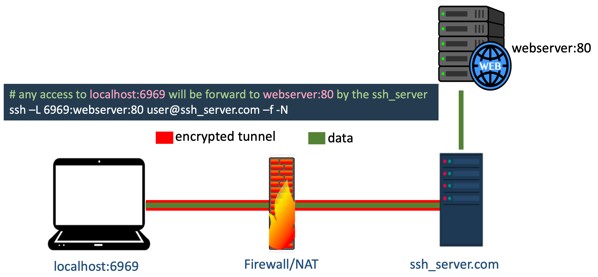
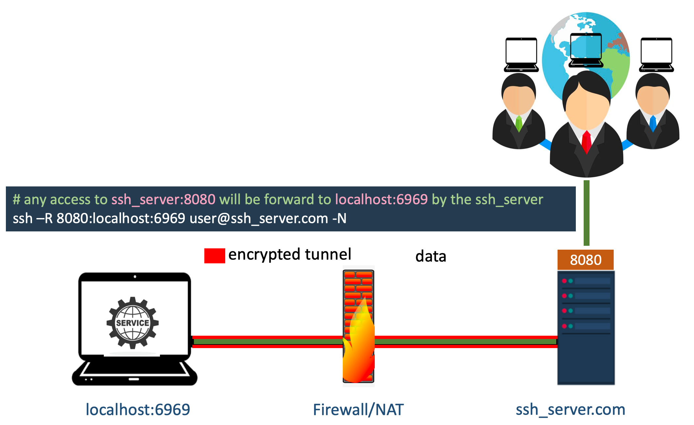

# Basic Network Utility

### <code>hostname</code>

```bash
# get hostname
hostname

# get IP (private ip) of hostname
hostname -i
```

> NAT (Network Address Translation)<br/>
> Using NAT computers with private IP addresses could communicate with other comuters in internet

### <code>ifconfig</code>
```bash
# show detail network interfaces 
ifconfig
```
### <code>ip -> ip address</code>
```bash
# show detail network interfaces 
ip address

# filter ip address
ip address | grep inet
```

### <code>ip -> ip route</code>

```bash
# To get information about routing table in the computer.
ip route
```

### <code>nslookup</code>
<code>nslookup</code> is a command-line tool to discover the IP address or DNS record of a specific domain name. <br/>
It also allows for reverse DNS lookup, letting you find the domain attached to an IP address. 

```bash
nslookup google.com

# Respose
Server:		xxx.xxx.xxx.xxx  # dns-server-ip
Address:	xxx.xxx.xxx.xxx#53 # dns-server-ip#port_dns

# show list of ip address of google.com
Non-authoritative answer:
Name:	google.com
Address: aaa.aaa.aaa.aaa
Name:	google.com
Address: bbb.bbb.bbb.bbb
Name:	google.com
Address: ccc.ccc.ccc.ccc
Name:	google.com
Address: ddd.ddd.ddd.ddd
Name:	google.com
Address: eee.eee.eee.eee
Name:	google.com
Address: fff.fff.fff.fff

```

### <code>traceroute</code>
```bash
# show routing how we get target server
traceroute google.com
```

### <code>netstat</code>
``` bash
#netstat -np <protocol> | find "port #"
netstat -np TCP | find "80"

# show table of all network interfaces
netstat -i
```

# Download Resources

### <code>curl</code>
```bash
curl url

# download html page of www.google.com
curl www.google.com
```


### <code>wget</code>
``` bash
# download file
wget url

# download recursively
wget -r url
```

# SCP
``` bash
# copy from remote to local
scp -r user@your.server.example.com:/path/to/foo /home/user/Desktop/

# copy from local to remote
scp -r /home/user/Desktop/ user@server_ip:/path/to/foo

# scp specific port
scp -P 123 myfile.zip myuser@mydomain.com:/home/workspace/myfile.zip

# scp copy directory recursively
scp -P 128 -rp MyFolder myuser@mydomain.com:/home/myuser/MyFolder
```

Parameters:
1. <code>-r</code> → recursive
2. <code>-p</code> → preserves/holds modification times, access times, and modes from the original file.


# SSH
``` bash
# ssh to specific port. The deafault is 22
ssh user@192.168.1.1 -p 2022

# ssh to docker container on local computer use localhost for the computer remote server.
# xxxx is local mapping port to the container port.
ssh user@localhost -p xxxx 
```

> If ssh using root user is not allowed, check ssh config on <code>/etc/ssh/sshd_config</code>


## Local Port Forward



``` bash
# any access to localhost:6969 will be forward to webserver:80 by the ssh_server
ssh –L 6969:webserver:80 user@ssh_server.com –f -N

```

The parameters are:
- <code>L</code> → specifies local port forwarding
- <code>f</code> → requests ssh to go to background just beforecommand execution,
- <code>N</code> → do not execute a remote command.

## Remote Port Forward


``` bash
# any access to ssh_server:8080 will be forward to localhost:6969 by the ssh_server
ssh –R 8080:localhost:6969 user@ssh_server.com -N

```
The parameters are:
- <code>R</code> → specifies remote port forwarding
- <code>N</code> → do not execute a remote command.


# References
- https://ret2rop.blogspot.com/2018/08/port-forwarding-ssh-tunneling.html