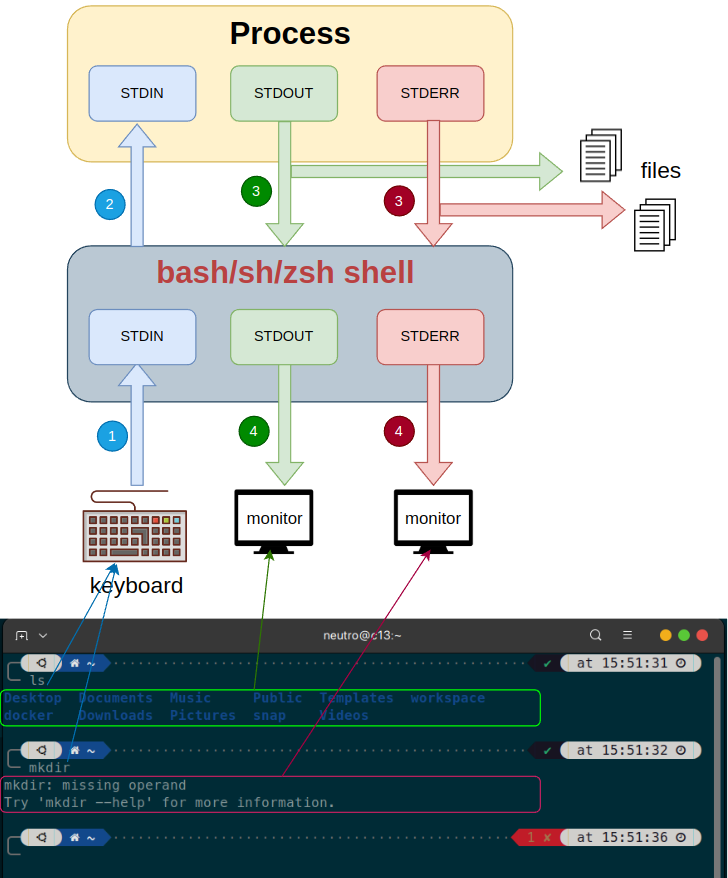
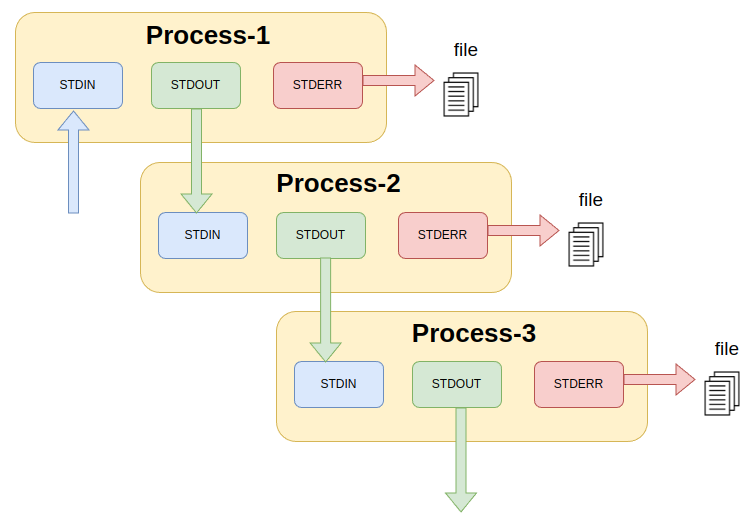

# About
When we enter a command, actually we run a specific process. 
For example, when we execute command <code>ls </code> or <code>mkdir</code> actually we run corresponding <code>ls</code> and <code>mkdir</code> process. Once the processes are called, they will start and do their job then stop.

There are also long running processes, such as bash shell, sh shell, etc.

# List Process


### List of Running Process
The following command to get list of process
```bash
ps --help all

# show all process and filter named chrome
ps -e | grep chrome
```

### List of Running Process Interactive Table
```bash
# using top
top
```

The other way is using **htop**
```bash
# install htop
sudo apt install htop

# show htop
htop

# show process using htop filter for specific user
htop -u neutro
htop --user=neutro 
```

### Kill Process

```bash
kill PID

# examle
kill 1557
```

# Data Stream of Process
Every process has 3 data stream.

<sub>*Data Stream of Process*</sub>
| ID        | Data Stream     |
| :---        |     :---:     | 
| 0     | <code>stdin</code>  | 
| 1     | <code>stdout</code> |
| 2     | <code>stderr</code> |




The cycle of process that is called from terminal is :
- The data input from keyboard
- The data will pass through <code>stdin</code> of shell
    ```bash
    # example normal command
    $ ls

    # example bad command
    # mkdir without specify directory name.
    $ mkdir
    ```
- The <code>stdin</code> shell will pass through data to the <code>stdin</code> of process
- If the command is valid, the process will response through the <code>stdout</code>. But if the command is invalid, the process will response through the <code>stderr</code>.

- By deafult the response of process <code>stdout</code> or <code>stderr</code> will be received by shell <code>stdout</code> or <code>stderr</code>. 

- We can redirect the output of <code>stdout</code> or <code>stderr</code> to file.
    ```bash
    # redirect stdout
    $ ls > output-normal.txt

    # redirect stderr
    $ mkdir 2> output-err.txt
    ```

- We can send stream to <code>stdin</code> of a process using in data stream operator <code> < </code>
    ```bash
    # normal using cat
    $ cat err.txt

    # send err.txt as a file stream to stdin.
    $ cat < err.txt

    # another way by specifying data stream ID (0=stdin)
    $ cat 0< err.txt
    

    # output of the two is the same. 
    # since the cat make the parameter as input stream as we do in the second way.
    ```

- We can also send <code>stdout</code> and <code>stderr</code> to files at once.
    ```bash
    # ls is the command
    # 1 is id of stdout
    # 2 is id of stderr
    # > is out data stream to a file (override of existing content)
    # >> is out data stream to a file (append to existing content)

    $ ls 1> output.txt 2> err.txt
    $ mkdir 1>> output.txt 2>> err.txt
    $ cat file_not_exist.txt 1>> output.txt 2>> err.txt
    ```

- We can also chain sending <code>stdout</code> a process to <code>stdin</code> other process.

    

    To send stdout of a pocess to other we use <code>|</code> operator

    ```bash
    $ echo "hello world"
    
    # the output is: 
    # hello world

    # stdout of echo will be stdin of cat.
    # the stdout of cat will be write to hello.txt
    $ echo "hello world" | cat > hello.txt

    # the result is same as the above using data stream ID (1=stdout)
    $ echo "hello world" | cat 1> hello.txt

    # same as above command except it will append instead of override
    $ echo "hello world again" | cat >> hello.txt

    # anothe way of append using data stream ID (1=stdout)
    $ echo "hello world again" | cat 1>> hello.txt
    ```