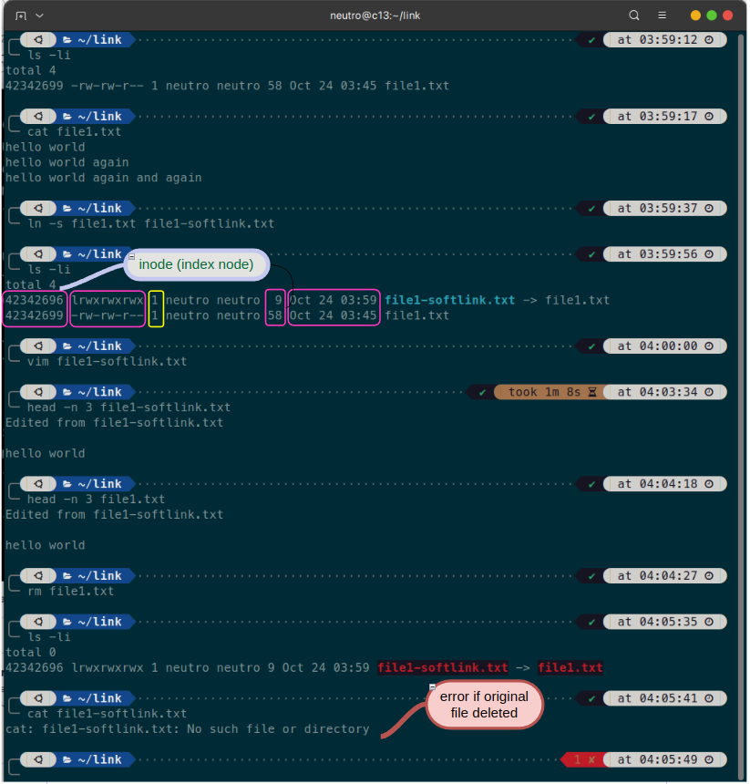
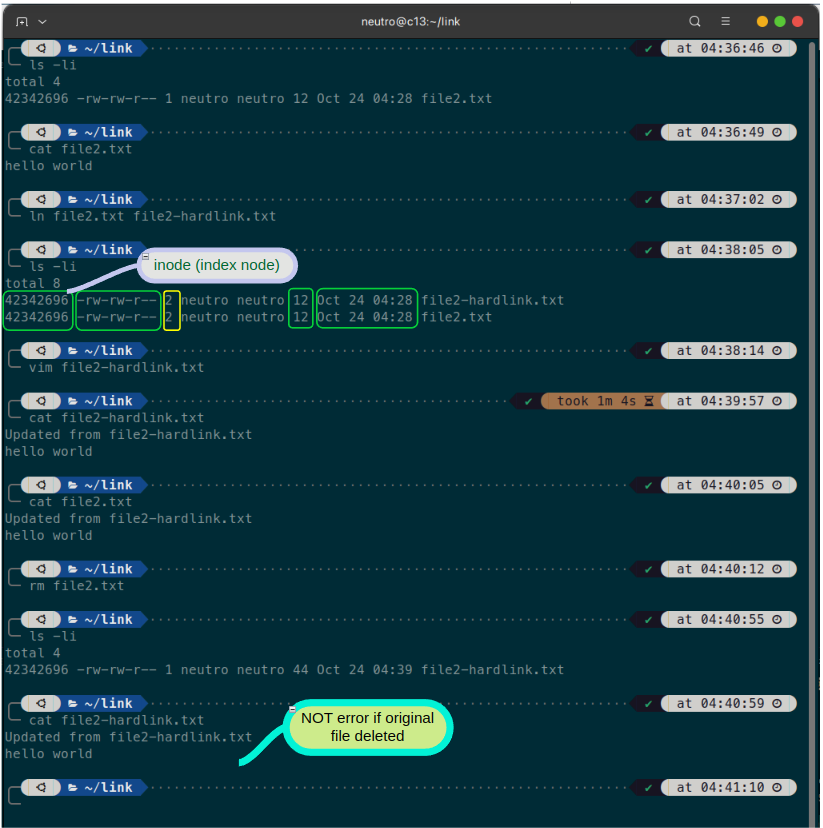

# Soft Link

```bash
ln -s FILE_ORIGINAL FILE_SOFT_LINK
```
Example:




# Hard Link

```bash
ln -s FILE_ORIGINAL FILE_HARD_LINK
```
Example:




# Summary

<sub>*Soft vs Hard Link*</sub>
| Item                                          | Soft          | Hard  |
| :---                                          | :---:         | :---: | 
| Modify file link will impact original file    | Yes           |   Yes | 
| Inode (Original vs Link)                      | Different     |   Same | 
| Access Right (Original vs Link)               | Different     |   Same |
| Modified Date Time (Original vs Link)         | Different     |   Same |
| Size (Original vs Link)                       | Different     |   Same | 
| Deleting original impact the link             | Yes           |   No   |  