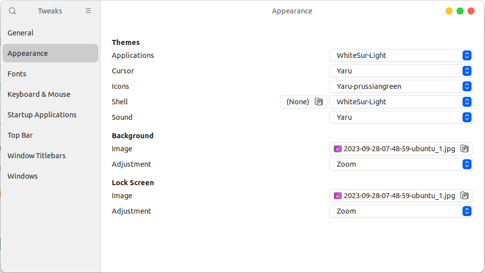

# MacOS Theme

1. Clone
    ```bash
    git clone https://github.com/vinceliuice/WhiteSur-gtk-theme.git --depth=1
    ```
2. 
    ```bash
    # for ubuntu only
    ./install.sh -t all -i ubuntu
    ```
3. Open tweek
    

4. Download Font https://github.com/sahibjotsaggu/San-Francisco-Pro-Fonts/blob/master/SF-Pro-Display-Regular.otf